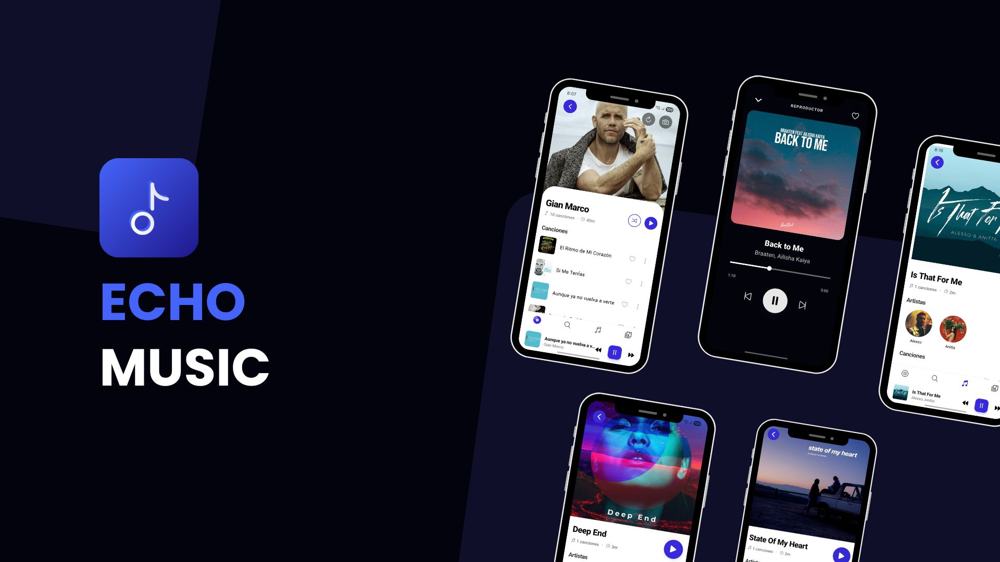
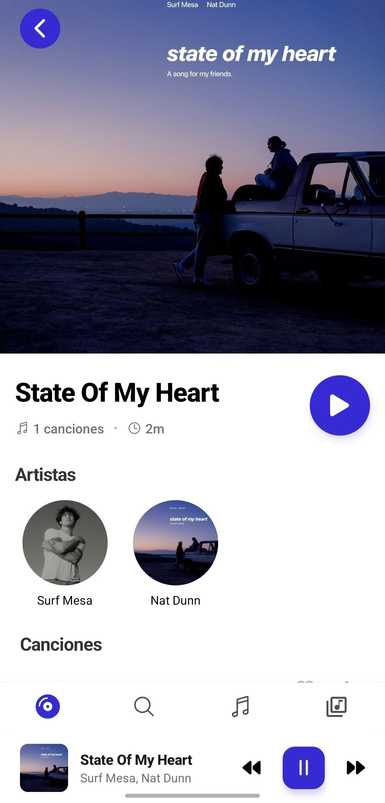
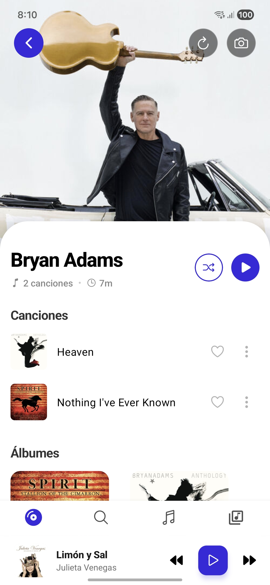
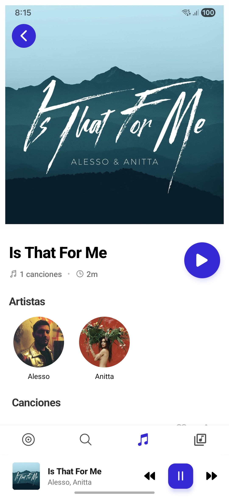
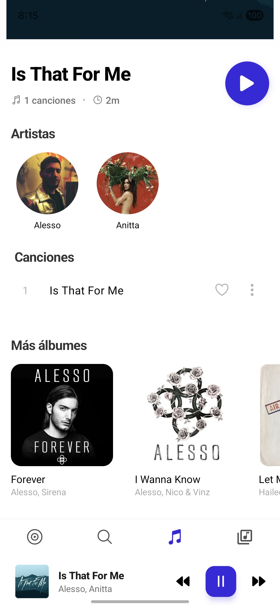

# Echo Music

<div align="center">
  <div align="center">
  <kbd>
    
  </kbd>
</div>
  <br />
  
   
   
  
  

  **Echo Music** is a high-performance, professional-grade mobile audio player built with React Native. Engineered with Clean Architecture principles to ensure scalability and ultra-fluid performance.

  ---

  **Echo Music** es un reproductor de audio móvil de alto rendimiento y grado profesional construido con React Native. Diseñado bajo los principios de Clean Architecture para garantizar escalabilidad y un rendimiento ultra fluido.
</div>

---

## 🖼️ Preview
<div align="center">
  
  <br />
  <i>(Gif preview coming soon / Vista previa en GIF próximamente)</i>
</div>

---

## 🚀 Features / Características

### **English**
- **Clean Architecture:** Domain-driven design with strict separation of concerns (Application, Domain, Infrastructure, Presentation).
- **Native Synchronization:** Advanced integration with `react-native-track-player` for precise playback control and dynamic queues.
- **Smart Persistence:** Indexed local media recovery using `expo-sqlite` for instant access to thousands of tracks.

### **Español**
- **Arquitectura Limpia:** Diseño orientado al dominio con separación estricta de capas (Aplicación, Dominio, Infraestructura, Presentación).
- **Sincronización Nativa:** Integración avanzada con `react-native-track-player` para control preciso y colas dinámicas.
- **Persistencia Inteligente:** Recuperación indexada de medios locales mediante `expo-sqlite` para acceso instantáneo.

---

## 🏗️ Project Structure / Estructura del Proyecto

The project follows a **Clean Architecture** pattern to isolate business logic from external frameworks:

```text
src/
├── application/     # DTOs, interfaces, and application use cases
├── core/            # Config, constants, errors, and theme settings
├── domain/          # Entities, repository interfaces, and value objects
├── infrastructure/  # API, persistence (SQLite), and native service implementations
└── presentation/    # UI components (features, navigation, shared, store/Zustand)
```

## 🛠️ Technologies / Tecnologías

- **React Native / Expo** (SDK 50+)
- **TypeScript** (Strong typing)
- **Zustand** (State management)
- **React Native Reanimated** (Fluid UI)
- **SQLite** (Local indexing)
- **React Native Track Player** (Native audio engine)

---

## ⚠️ Technical Note: Performance / Nota Técnica: Rendimiento

> [!IMPORTANT]
> **Performance Optimization:** To ensure a smooth experience on devices with large libraries, the service is configured to fetch media in limited batches.
>
> **Optimización de Rendimiento:** Para asegurar una experiencia fluida en dispositivos con librerías extensas, el servicio está configurado para obtener los archivos en lotes limitados:

```typescript
// src/infrastructure/services/native-media.service.ts
const media = await MediaLibrary.getAssetsAsync({
  mediaType: "audio",
  // Optimized for initial load / Optimizado para carga inicial
  first: 100, 
});
```

## 📸 Screenshots / Capturas

<div align="center">
  <table>
    <tr>
      <td align="center"><b>Library</b><br></td>
      <td align="center"><b>Player</b><br></td>
      <td align="center"><b>Playlists</b><br></td>
    </tr>
    <tr>
      <td align="center"><b>Artists</b><br></td>
      <td align="center"><b>Albums</b><br></td>
      <td align="center"><b>Settings</b><br></td>
    </tr>
  </table>
  <br />
  <sub>Full gallery (s1 to s12) available in the <code>./screenshots/</code> folder.</sub>
</div>

---

## 🛠️ Installation / Instalación

Follow these steps to set up the project locally:  
*Sigue estos pasos para configurar el proyecto localmente:*

### 1️⃣ Clone the repository / Clonar el repositorio
```bash
git clone [https://github.com/Luis3Fernando/EchoMusic](https://github.com/Luis3Fernando/EchoMusic)
cd EchoMusic
```
### 2️⃣ Install dependencies / Instalar dependencias
```bash
npm install
# or / o
yarn install
```
### 3️⃣ Configure Permissions (Optional) / Configurar Permisos
Make sure your device/emulator has media reading permissions enabled for Expo Media Library.

Asegúrate de que tu dispositivo o emulador tenga habilitados los permisos de lectura para Expo Media Library.

### 4️⃣ Start the project / Iniciar el proyecto
```bash
npx expo start
```
---

## 🚧 Project Status / Estado del Proyecto

<div align="center">
  
</div>

### **English**
This project is currently in **active development**. While the core architecture and audio engine are stable, we are continuously working on:
- UI/UX refinements and micro-interactions.
- Performance optimizations for massive local libraries.
- Advanced synchronization for lyrics and metadata.

### **Español**
Este proyecto se encuentra actualmente en **desarrollo activo**. Aunque la arquitectura base y el motor de audio son estables, seguimos trabajando en:
- Refinamiento de la UI/UX y micro-interacciones.
- Optimizaciones de rendimiento para librerías locales masivas.
- Sincronización avanzada de letras y metadatos.

---
